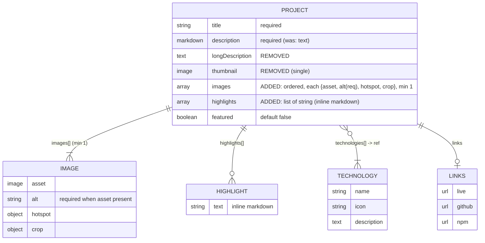
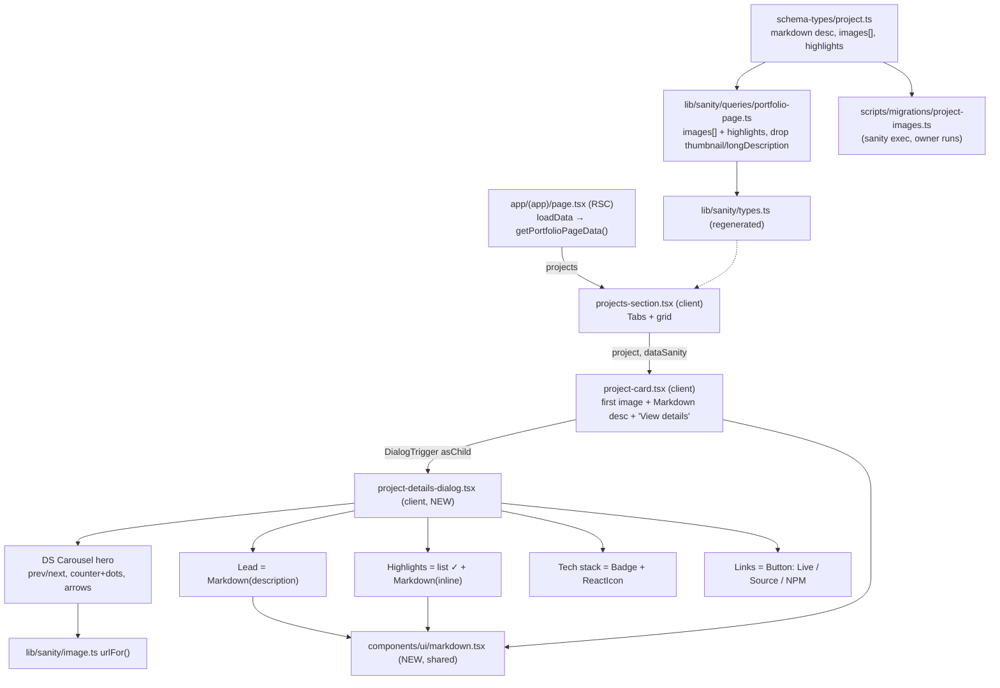

# Plan: Improve Projects Presentation Using Extended Details Dialog

**Spec:** `specs/projects-extended-details-dialog/spec.md`
**Status:** draft

## High-level approach

We enrich the Sanity `project` model and add a client-side **Project Details dialog** that opens
from a project card, following the Claude Design "Cinematic Hero" variant. On the data side:
`description` becomes Markdown, the single `thumbnail` is replaced by an ordered `images` collection
(each with alt text, min 1), a new `highlights` list of inline-Markdown texts is added, and the
unused `longDescription` is removed. Generated Sanity types are regenerated and a one-off
`sanity exec` migration (run by the owner) moves each project's former thumbnail into `images[0]`
and drops `longDescription`.

On the UI side, the existing `components/sections/projects/project-card.tsx` is reworked to show the
**first image**, render the Markdown description, drop the Live/Code/NPM buttons, and present a
**"View details"** affordance that opens the dialog (the whole card is the trigger). A new
`project-details-dialog.tsx` composes the DS `Dialog` + `Carousel` into a hero carousel (prev/next,
counter + dots, arrow keys) with body sections Lead, Highlights (✓ list), Tech stack (icon badges)
and Links (Live/Source/NPM). A shared `Markdown` renderer is extracted from the existing
`about/bio-markdown.tsx` pattern and reused by card, lead, and highlights. The dialog is purely
client-side (no URL change) and the same component reflows responsively on mobile. All new code
follows the constitution (function keyword, `import * as React`, `Array<Type>`, ternary rendering,
DS tokens only); the existing `&&` conditionals in the card are converted to ternaries.

## Data model

Sanity `project` document — before vs after this change (◀ removed, ▶ added/changed):

## Component diagram

## API surface

No HTTP endpoints. The data surface is the Sanity GROQ query and its generated type; the dialog is
client-only with no server action and no URL change.

| Surface | Kind | Input | Output | Auth |
|---------|------|-------|--------|------|
| `portfolioPageQuery` projects projection (`lib/sanity/queries/portfolio-page.ts`) | GROQ | — | `images[]`, `highlights`, `description`, `technologies[]`, `links`, `featured` (no `thumbnail`/`longDescription`) | public read |
| `getPortfolioPageData()` (`lib/sanity/services/portfolio-page.ts`) | service (tuple) | — | `[error, PortfolioPageQueryResult]` | public |
| `project-images.ts` migration | `sanity exec` script | dataset + user token | mutated `project` docs (`images[0]=thumbnail`, unset `thumbnail`/`longDescription`) | owner token |

## File-by-file change list

- `lib/sanity/configuration/schema-types/project.ts` — `description`→`markdown`; remove
  `longDescription`; replace `thumbnail` with `images` (array of image+alt, hotspot, min 1); add
  `highlights` (array of string); `preview.select.media`→`images.0`.
- `lib/sanity/queries/portfolio-page.ts` — projects projection: drop `longDescription`, replace
  `thumbnail {…}` with `images[] {…}`, add `highlights`.
- `lib/sanity/types.ts` — **regenerated** via `npm run sanity:typegen` (no hand edits).
- `scripts/migrations/project-images.ts` — **new** idempotent migration (owner runs via
  `npx sanity exec scripts/migrations/project-images.ts --with-user-token`).
- `components/ui/markdown.tsx` — **new** shared `Markdown` renderer (extracted from
  `about/bio-markdown.tsx`; add `inline` variant mapping `p`→`span` for highlights).
- `components/sections/about/bio-markdown.tsx` — repoint to the shared `Markdown` (thin wrapper).
- `components/sections/projects/project-card.tsx` — first image; Markdown description (clamped);
  remove `CardFooter` link buttons; add "View details" affordance; whole card = dialog trigger;
  convert `&&` → ternary.
- `components/sections/projects/project-details-dialog.tsx` — **new** dialog (hero carousel + Lead +
  Highlights + Tech stack + Links).
- `components/sections/projects/project-image-carousel.tsx` — **optional** split-out of the hero
  carousel if the dialog grows; otherwise inline.
- `tests/builders/portfolio-page.builder.ts` — update `projectBuilder`: `images` (≥1), `highlights`,
  drop `thumbnail`/`longDescription`.
- `components/sections/projects/project-card.stories.tsx` — update for new card (first image,
  markdown, "View details" opens dialog, no footer buttons).
- `components/sections/projects/project-details-dialog.stories.tsx` — **new** stories + interaction
  tests (many/one image, with/without links, with/without highlights, markdown).
- `components/ui/markdown.test.ts` (or `.stories.tsx` test) — **new** renderer unit/interaction test
  (formats elements; raw HTML not executed).
- `tests/e2e/main-page.e2e.ts` — adjust (card no longer has a GitHub "Code" link; open dialog first).
- `tests/e2e/project-details.e2e.ts` — **new** open→sections visible→carousel→Esc closes.

## Reused utilities

- `react-markdown` + `remark-gfm` and the override pattern in
  `components/sections/about/bio-markdown.tsx` — basis for the shared `Markdown` renderer.
- DS `Dialog` (`@szum-tech/design-system/components/dialog`) and `Carousel`
  (`@szum-tech/design-system/components/carousel`) — dialog shell + hero carousel.
- DS `Badge` + `BadgeOverflow`, `Button`, `Card` — already used by the card.
- `components/ui/react-icon.tsx` (`ReactIcon`, `IconName`) — technology icons.
- `lib/sanity/image.ts` `urlFor()` — image URLs for card + carousel.
- `lib/sanity/utils` `buildSanityAttribute()` + `stegaClean` (next-sanity) — Studio live-edit stega.
- Sanity `markdownSchema` plugin (already registered in `sanity.config.ts`) — enables the `markdown`
  field type for `description`.
- Test harness: `preview.meta()`/`.story()`/`.test()` (Storybook+Vitest), `projectBuilder`/
  `technologyBuilder` (`tests/builders/portfolio-page.builder.ts`), Playwright `tests/e2e/*.e2e.ts`.

## Risks & mitigations

- **Risk:** the migration unsets fields (destructive). **Mitigation:** idempotent script (skip
  already-migrated docs), run on a non-prod dataset first; owner executes it deliberately with a
  token.
- **Risk:** Markdown + `line-clamp` on the card spans block elements and may clamp awkwardly.
  **Mitigation:** keep card markdown minimal and clamp the rendered container; full formatting lives
  in the dialog.
- **Risk:** `Dialog`/`Carousel` not yet imported anywhere in this repo. **Mitigation:** confirm both
  are exported by `@szum-tech/design-system@3.21.7` at implementation start (present in DS source).
- **Risk:** carousel counter/dots need the carousel `api`. **Mitigation:** derive current/total via
  `setApi` (`selectedScrollSnap`/`scrollSnapList`); hide controls when a single image.
- **Risk:** raw HTML in CMS Markdown. **Mitigation:** `react-markdown` does not render raw HTML by
  default — assert this in the renderer test (AC1).
- **Risk:** existing E2E asserts a card-level GitHub link that moves into the dialog.
  **Mitigation:** update `main-page.e2e.ts` to open the dialog before asserting the link.

## Open questions for human review

- _None blocking._ Minor implementation choices left to `/sdd:tasks` / `/sdd:implement`: whether the
  hero carousel is split into its own `project-image-carousel.tsx`; exact "View details" affordance
  copy/icon; and whether `images` should also carry an optional caption (not required by the design —
  defaulting to **no caption** unless requested).
